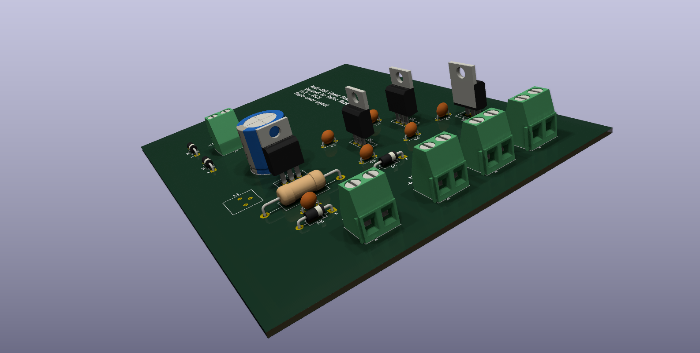
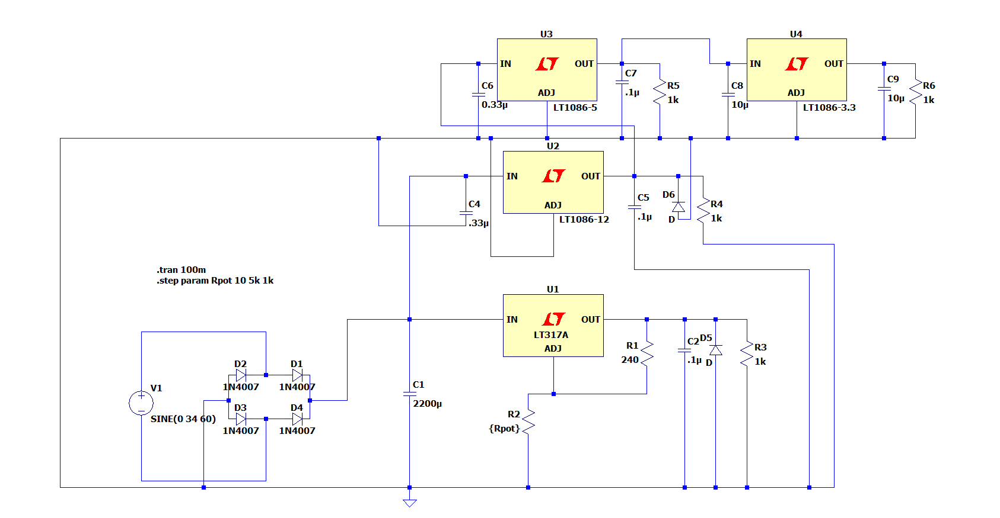

# Cascaded Multi-Rail AC-DC Linear Power Supply

A hardware design and simulation repository for a custom variable linear AC-to-DC power supply. The circuit relies on the LM adjustable voltage regulator and the fixed voltage regulators to provide stable, clean power for lab and prototyping environments. 



## Features
* **Multi-Rail Output:** Provides four distinct power rails: an adjustable output (1.25V–21V) via an LM317, and three fixed digital logic rails (12V, 5V, 3.3V).
* **Cascaded Architecture:** The fixed voltage regulators (LM7812, LM7805, and a LM-1117) are strategically cascaded. The main 34V DC bus feeds the 12V IC, which feeds the 5V IC, which finally feeds the LM1117-3.3 LDO to provide a clean 3.3V logic rail. This distributes thermal dissipation across the board and prevents the lower-voltage ICs from instantly overheating.
* **Thermal & Layout Optimization:** Designed on a strictly single-layer PCB using a manual 1.0mm common ground bus to safely manage continuous current and heat.
* **Safety & Transient Protection:** Integrated 1N4007 flywheel (flyback) diodes in reverse-biased parallel across the LM317 and LM7812 regulators. This creates a safe discharge path for output capacitors and protects the silicon from reverse-current spikes during power-off events.
* **Validated Design:** Component tolerances, inductive flyback protection, and ripple voltages across the cascaded rails were verified in LTspice prior to physical layout.



## Repository Structure

```text
├── simulation/  # LTspice simulation files and waveform plots
├── hardware/    # KiCad schematics, PCB layout, and 3D models
│   └── gerbers/ # Manufacturing files for PCB fabrication
├── hardware_1.2/ # New KiCad schematics, PCB layout, and 3D models with some minor changes
│   └── gerbers/ # Manufacturing files for New PCB fabrication
└── README.md
```

## Prerequisites

To view or modify the files in this project, you will need:
* **[LTspice](https://www.analog.com/en/design-center/design-tools-and-calculators/ltspice-simulator.html):** For running the `.asc` circuit simulations.
* **[KiCad (v7.0+)](https://www.kicad.org/):** For opening the schematic and PCB files.

## Getting Started

1. **Simulation:** Open `Simulation/main_design.asc` in LTspice and click 'Run' to view the transient analysis and ripple voltages.
2. **Hardware:** Open `Hardware_1.2/vdc.kicad_pro` in KiCad to explore the schematic and PCB layout.
3. **Fabrication:** The production-ready Gerber files are located in `hardware/gerbers/`.

## License
This project is open-source and available under the [MIT License](LICENSE).
